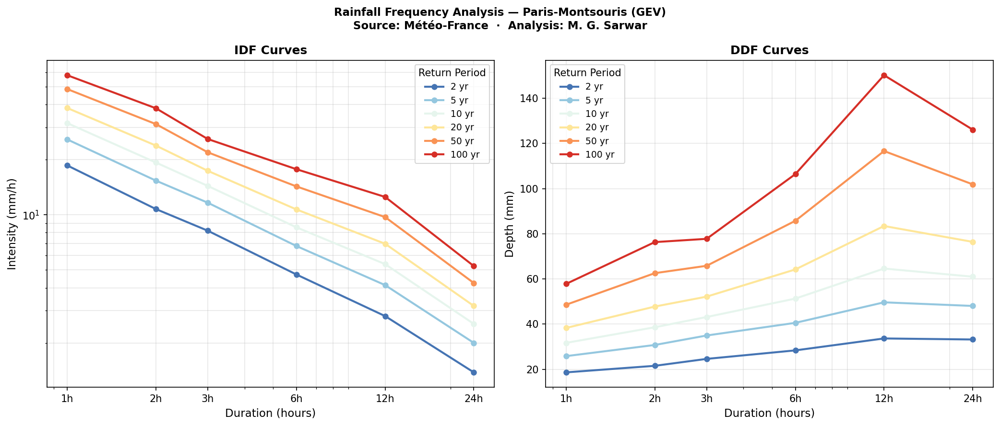
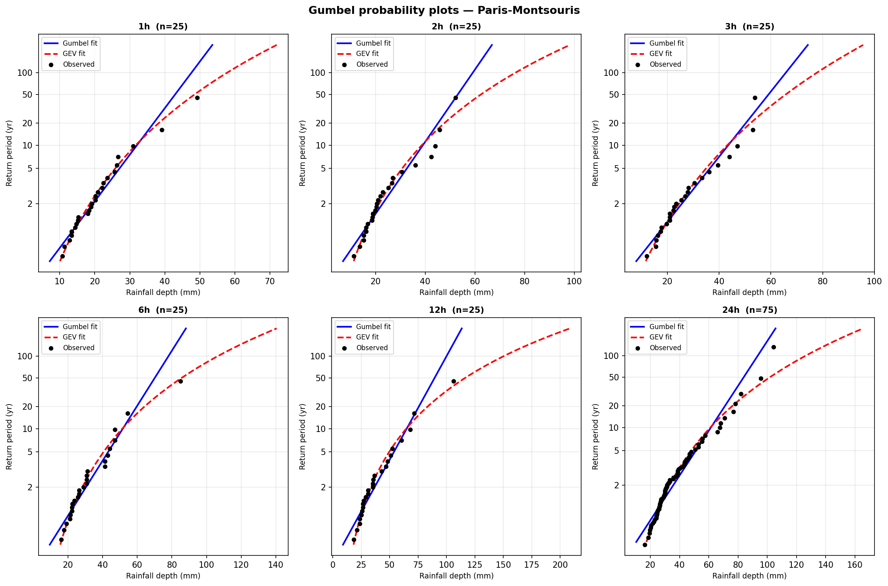
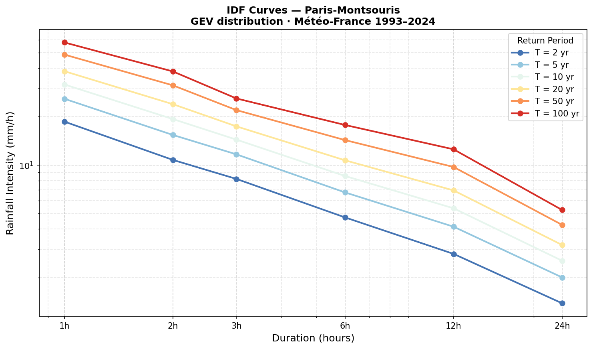
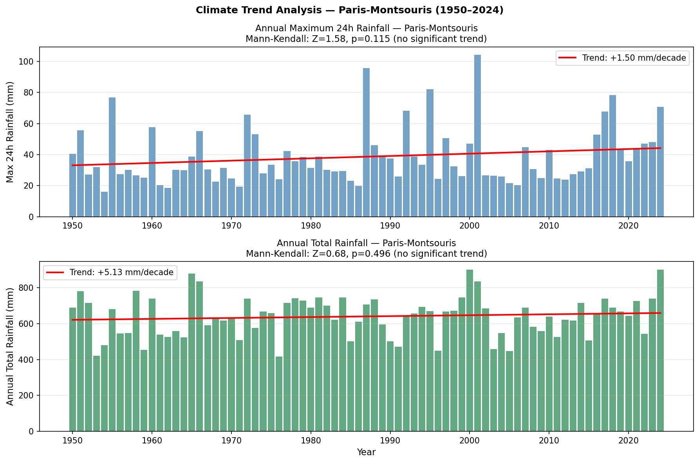
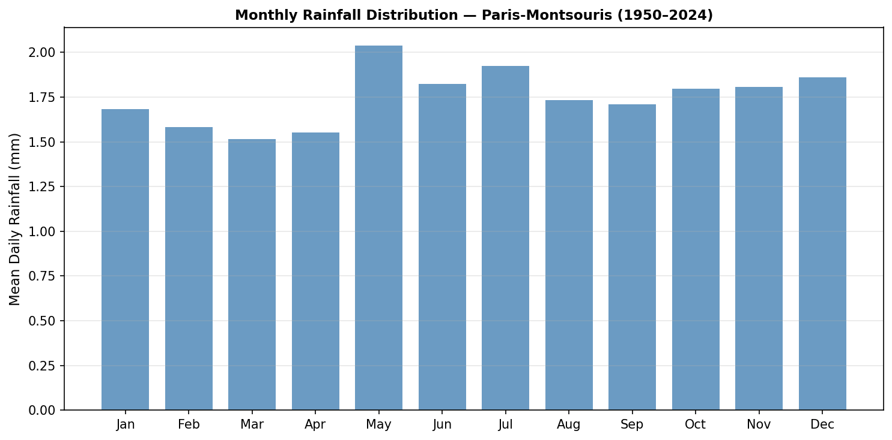

# Rainfall Intensity–Duration–Frequency (IDF) Analysis
### Paris-Montsouris Station · Île-de-France · 1950–2024

**Author:** Md Golam Sarwar — Hydraulic Engineer · MSc Grenoble INP-ENSE3  
**Data:** Météo-France open data (meteo.data.gouv.fr)  
**Station:** Paris-Montsouris · ID 75114001 · 48.82°N 2.34°E · Alt. 75 m  

---

## What this project does

Urban drainage systems, stormwater networks, retention basins, and flood protection structures all share one fundamental design requirement: the engineer must know, for a given storm duration and acceptable risk level, what rainfall intensity the infrastructure must handle. This relationship is captured by **Intensity–Duration–Frequency (IDF) curves** — the primary tool of urban hydrology.

This project derives IDF curves for Paris from scratch using 75 years of daily observations (1950–2024) and 32 years of hourly data (1993–2024) from the Paris-Montsouris station, the longest and most complete meteorological record in the Paris region. The analysis follows the **Annual Maxima (AM) method** with **Generalized Extreme Value (GEV)** distribution fitting, validated against the Gumbel distribution. A Mann-Kendall trend test is also applied to assess whether extreme rainfall is changing under climate change.

---

## Data

| File type | Source | Period | Station |
|-----------|--------|--------|---------|
| Daily (`Q_75_*`) | Météo-France | 1950–2024 | Paris (dép. 75) |
| Hourly (`H_75_*`) | Météo-France | 1990–2026 | Paris (dép. 75) |

All data downloaded from [meteo.data.gouv.fr](https://meteo.data.gouv.fr) under the open Etalab licence. Raw files are **not committed** to this repository (large gzip-compressed CSVs). The `results/` folder contains all derived outputs.

**Why Paris-Montsouris?**  
Among all stations in départements 75 and 93, Paris-Montsouris has the longest uninterrupted record: 27,394 daily observations from January 1950 to December 2024 with zero missing quality-flagged values, and 312,303 hourly records from 1990 to 2026.

---

## Methodology

### Step 1 — Annual Maxima Extraction

For each year and each duration, a single value is extracted: the highest observed rainfall depth. For the 24-hour duration this comes directly from daily records. For sub-daily durations (1h, 2h, 3h, 6h, 12h), a **rolling sum** is applied to the hourly time series, and the annual maximum of that rolling sum is retained.

Years with insufficient data are excluded:
- Daily: years with fewer than 300 valid days removed
- Hourly: years with fewer than 7,000 valid hours removed

This yields **75 years** of 24h annual maxima (1950–2024) and **25 years** of sub-daily maxima (2000–2024).

### Step 2 — Distribution Fitting

Two extreme value distributions are fitted to each annual maxima series:

**Gumbel (EV Type I)** — fitted via L-moments, which are more robust than standard moments for small samples of extremes. The quantile function is:

```
x(T) = μ − α × ln(−ln(1 − 1/T))
```

where μ is the location parameter, α the scale parameter, and T the return period in years. Parameters are estimated as:

```
α = L₂ / ln(2)
μ = L₁ − 0.5772 × α        (Euler–Mascheroni constant)
```

**GEV (Generalized Extreme Value)** — fitted via Maximum Likelihood Estimation using `scipy.stats.genextreme`. The GEV unifies three extreme value families through a shape parameter ξ:
- ξ = 0 → Gumbel (light tail)
- ξ > 0 → Fréchet (heavy tail, unbounded above)
- ξ < 0 → Weibull (bounded above)

**Goodness-of-fit** is assessed using the Kolmogorov–Smirnov (KS) test at significance level α = 0.05. Probability plots use **Gringorten (1963) plotting positions**:

```
pᵢ = (i − 0.44) / (n + 0.12)
```

### Step 3 — IDF Construction

Design rainfall **depths** (mm) are read from the GEV quantile function for each duration–return period combination. **Intensities** (mm/h) are derived as:

```
i (mm/h) = depth (mm) / duration (h)
```

### Step 4 — Trend Analysis

A non-parametric **Mann-Kendall test** is applied to both the 24h annual maxima series (1950–2024) and the annual total rainfall series. The Mann-Kendall S statistic counts concordant minus discordant pairs across the time series. A standardised Z score and two-tailed p-value are computed. The null hypothesis is no monotonic trend.

A linear (OLS) trend is also fitted for visual reference on the time series plots.

---

## Results

### IDF and DDF Curves



*Figure 1. Left: IDF curves (rainfall intensity vs duration, log–log scale). Right: DDF curves (rainfall depth vs duration). GEV distribution, Paris-Montsouris, return periods 2–100 years.*

The curves show the expected power-law decrease of intensity with duration on log-log axes. The spread between return periods widens at longer durations, reflecting greater variability in multi-hour extreme events.

### Design Rainfall Table (GEV)

| Duration | T = 2 yr | T = 5 yr | T = 10 yr | T = 20 yr | T = 50 yr | T = 100 yr |
|----------|----------|----------|-----------|-----------|-----------|------------|
| **1h**   | 19.3 mm  | 27.3 mm  | 33.1 mm   | 39.1 mm   | 47.5 mm   | 54.2 mm    |
| **2h**   | 22.7 mm  | 33.0 mm  | 41.3 mm   | 50.5 mm   | 64.7 mm   | 77.2 mm    |
| **3h**   | 25.7 mm  | 36.6 mm  | 44.8 mm   | 53.4 mm   | 65.8 mm   | 76.1 mm    |
| **6h**   | 29.3 mm  | 42.1 mm  | 53.2 mm   | 66.6 mm   | 88.9 mm   | 110.2 mm   |
| **12h**  | 34.5 mm  | 49.9 mm  | 63.8 mm   | 80.8 mm   | 109.6 mm  | 137.9 mm   |
| **24h**  | 33.2 mm  | 48.0 mm  | 61.0 mm   | 76.4 mm   | 101.9 mm  | 126.1 mm   |

Full table with intensities (mm/h): [`results/idf_table_final.csv`](results/idf_table_final.csv)

### Gumbel Probability Plots — All Durations



*Figure 2. Gumbel probability plots for all six durations. Black dots: observed annual maxima (Gringorten plotting positions). Blue line: Gumbel fit (L-moments). Red dashed line: GEV fit (MLE). The y-axis is the Gumbel reduced variate, re-labelled as return period in years.*

Both distributions pass the KS test at α = 0.05 for all durations. The GEV fit captures the upper tail more conservatively — particularly important for long return periods (T = 50 and 100 years) where the Gumbel tends to underestimate. **The GEV is used for all design values.**

The negative shape parameters (ξ ranging from −0.10 to −0.33) indicate a Weibull-type tail — meaning there is a finite upper bound to extreme rainfall at Paris, which is physically consistent with the mid-latitude oceanic climate.

### IDF Curves (standalone)



*Figure 3. IDF curves on log–log axes. Each line is a return period. The parallel lines confirm the classic power-law scaling i = a / d^b, where a and b depend on return period.*

---

## Trend Analysis



*Figure 4. Top: annual maximum 24h rainfall (1950–2024) with OLS trend line. Bottom: annual total rainfall with trend line. Red line = OLS regression. Mann-Kendall test results shown in titles.*

### Mann-Kendall Results

| Series | S statistic | Z score | p-value | Conclusion |
|--------|-------------|---------|---------|------------|
| 24h annual maxima | 346 | +1.58 | 0.114 | **No significant trend** |
| Annual total rainfall | 150 | +0.68 | 0.496 | **No significant trend** |

Neither the extreme rainfall (24h annual maxima) nor the total annual precipitation shows a statistically significant trend over the 1950–2024 period at the 5% significance level.

The positive Z scores indicate a slight upward tendency — the linear trend is approximately **+1.5 mm/decade** for 24h maxima and **+5 mm/decade** for annual totals — but neither is distinguishable from natural variability at this record length.

**What this means in practice:** The absence of a statistically significant trend does not mean climate change has no effect on Paris rainfall. It means that 75 years of data is insufficient to detect a signal above the very high natural year-to-year variability of extreme events (coefficient of variation ≈ 0.35). The IPCC AR6 and Cerema both project increases in extreme rainfall intensity for northern France of the order of 5–15% by 2050 under RCP4.5. For long-lived infrastructure (design life > 50 years), applying a **climate change adjustment factor of 1.15×** on design rainfall values is recommended.

### Monthly Distribution



*Figure 5. Mean daily rainfall by month (1950–2024). Paris shows a relatively uniform distribution typical of temperate oceanic climates, with a slight autumn maximum (October) and spring secondary peak.*

---

## Repository Structure

```
rainfall-idf-analysis/
├── data/                                    ← Raw Météo-France files (not committed)
│   ├── Q_75_previous-1950-2024_RR-T-Vent.csv.gz
│   ├── H_75_2000-2009.csv.gz
│   └── ...
├── scripts/
│   ├── 01_explore_data.ipynb               ← Data loading, station selection, QA
│   ├── 02_annual_maxima.ipynb              ← AM extraction (daily + rolling hourly)
│   ├── 03_distribution_fitting.ipynb       ← Gumbel + GEV fitting, probability plots
│   ├── 04_idf_curves.ipynb                 ← IDF/DDF tables and plots
│   ├── 05_trend_analysis.ipynb             ← Mann-Kendall + climate comparison
│   └── 06_final_export.ipynb               ← Final CSV export + summary
├── results/
│   ├── idf_table_final.csv                 ← Complete IDF table (depths + intensities)
│   ├── design_rainfall_gev.csv             ← GEV design depths (mm)
│   ├── design_rainfall_gumbel.csv          ← Gumbel design depths (mm)
│   ├── idf_ddf_combined.png
│   ├── idf_curves.png
│   ├── ddf_curves.png
│   ├── probability_plots_all_durations.png
│   ├── trend_analysis.png
│   └── monthly_distribution.png
└── README.md
```

---

## How to Reproduce

```bash
# 1. Clone the repository
git clone https://github.com/domaincertificatedoesntmatter/rainfall-idf-analysis.git
cd rainfall-idf-analysis

# 2. Create virtual environment
python3 -m venv venv
source venv/bin/activate          # macOS/Linux
# venv\Scripts\activate           # Windows

# 3. Install dependencies
pip install pandas numpy scipy matplotlib jupyter geopandas

# 4. Download raw data from meteo.data.gouv.fr
#    Place files in data/ (Q_75_* daily and H_75_* hourly, départements 75 and 93)

# 5. Run notebooks in order
jupyter notebook
# Run: 01 → 02 → 03 → 04 → 05 → 06
```

---

## Key References

- **Gumbel, E.J. (1958).** Statistics of Extremes. Columbia University Press.
- **Hosking, J.R.M. (1990).** L-moments: Analysis and estimation of distributions using linear combinations of order statistics. *Journal of the Royal Statistical Society B*, 52(1), 105–124.
- **Coles, S. (2001).** An Introduction to Statistical Modeling of Extreme Values. Springer.
- **Mann, H.B. (1945).** Nonparametric tests against trend. *Econometrica*, 13, 245–259.
- **Gringorten, I.I. (1963).** A plotting rule for extreme probability paper. *Journal of Geophysical Research*, 68(3), 813–814.
- **Météo-France.** Données climatologiques de base – données horaires. meteo.data.gouv.fr
- **IPCC AR6 WGI (2021).** Chapter 11: Weather and Climate Extreme Events in a Changing Climate.

---

## License

Data: © Météo-France — Licence Ouverte Etalab v2.0  
Code and analysis: MIT License

---

*Part of a hydrology/hydraulics portfolio — [mdgolamsarwar.com](https://mdgolamsarwar.com)*
